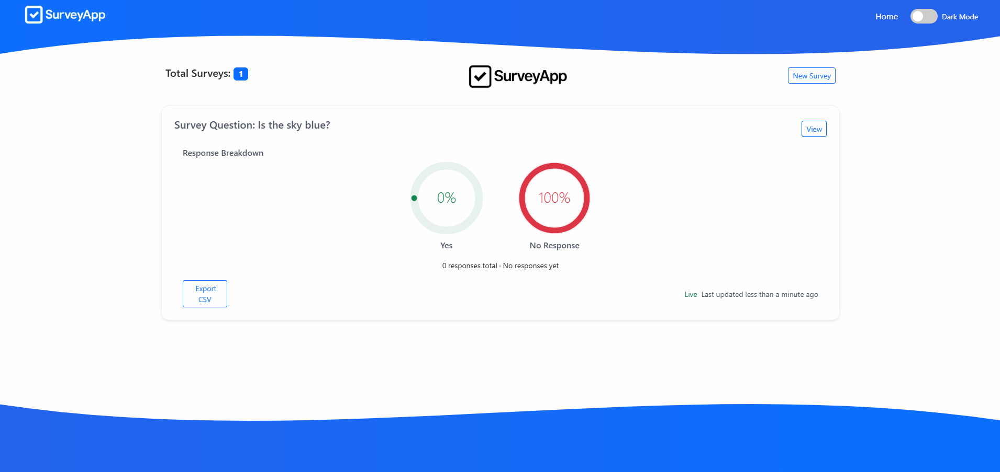
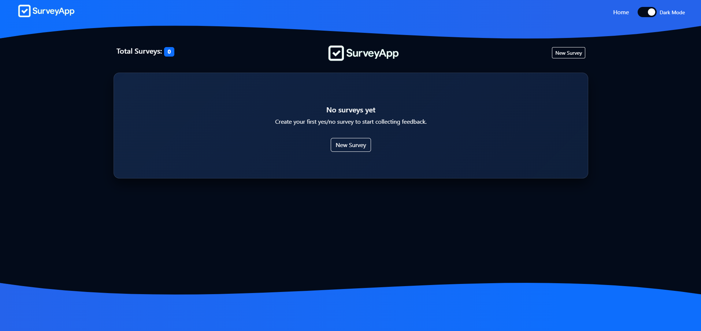
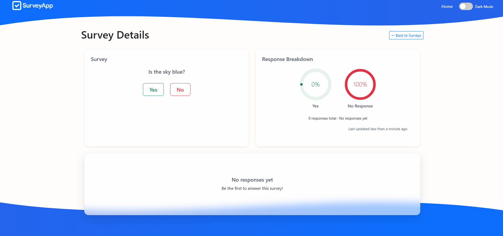
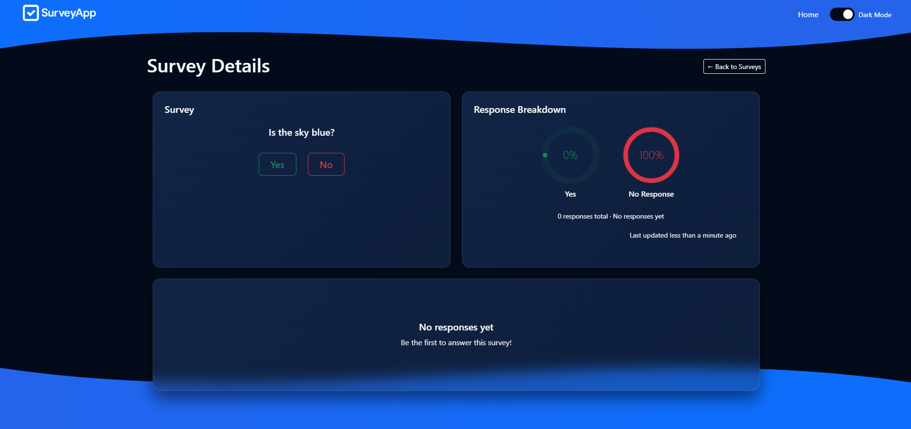
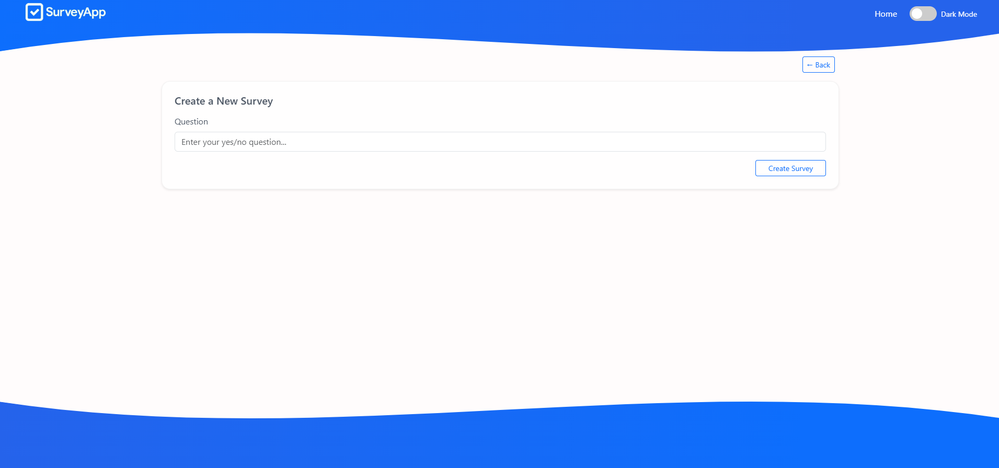
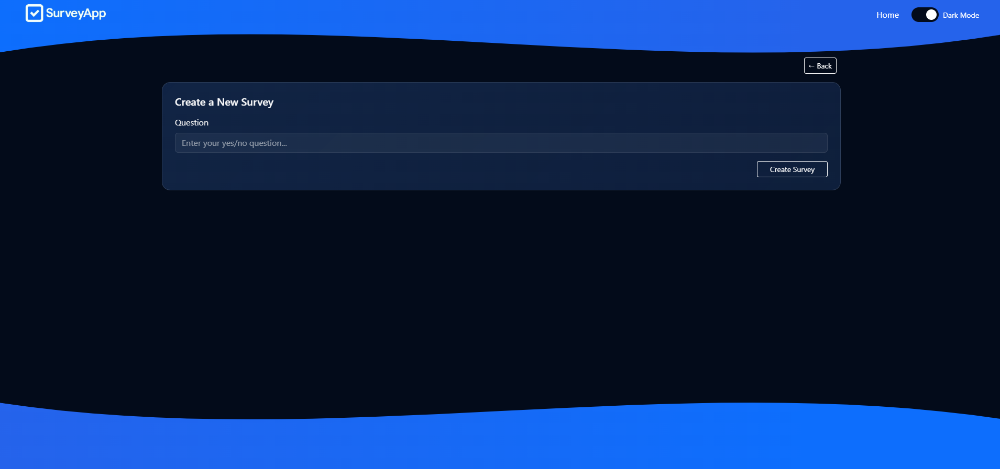
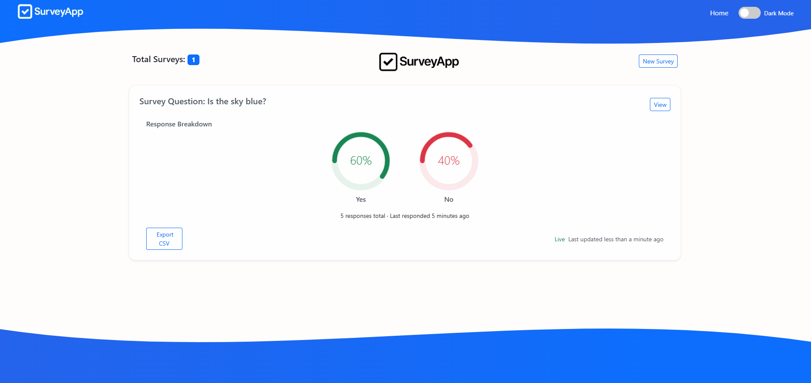
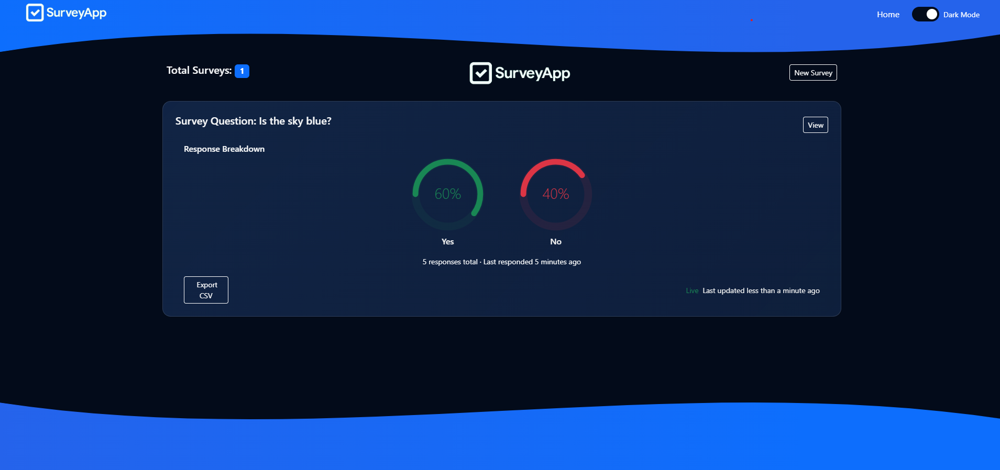
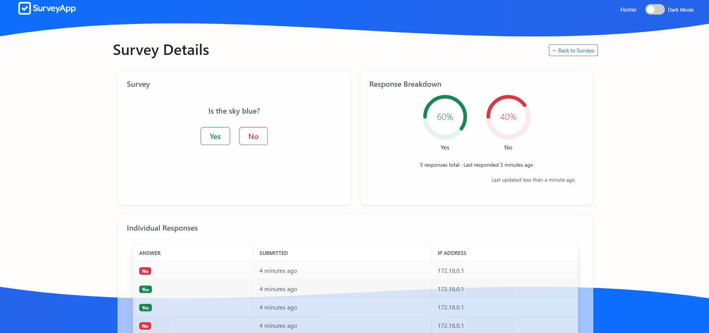
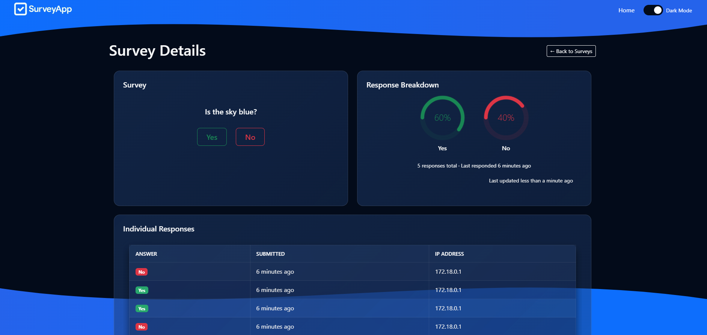

# 📊 Survey Application

[](https://www.ruby-lang.org/en/)
[](https://rubyonrails.org/)
[](LICENSE)
[](https://www.docker.com/)

A minimalist Rails app for creating and sharing simple yes/no surveys — built with a component-based architecture, responsive mobile-first UI, dark mode themes, animated visuals, and exportable results.

---

## 📚 Table of Contents

- [🚀 Features](#-features)
- [⚙️ Requirements](#️-requirements)
- [🔧 Setup Instructions](#-setup-instructions)
- [🎨 SCSS Architecture](#-scss-architecture)
- [📦 ViewComponents](#-viewcomponents)
- [⚙️ Stimulus Controllers](#-stimulus-controllers)
- [🖼️ Screenshots](#️-screenshots)
- [🧪 Running Tests](#-running-tests)
- [📄 License](#-license)
- [✨ Highlights](#-highlights)
- [🧠 Dev Tips](#-dev-tips)
- [🔄 Export & Sharing](#-export--sharing)

---

## 🚀 Features

- Create unlimited surveys (one yes/no question per survey)
- Anonymous voting (no accounts or logins)
- Stores response timestamps and IPs
- Results include:
  - ✅ Yes/No percentages
  - 📊 Animated radial charts (SVG)
  - 🕒 Full response history
- Mobile-first UI built with Bootstrap 5
- 🌗 Dark mode detection with animated glassmorphism styling
- 🧩 Modular ViewComponents for clean UI building blocks
- ⚙️ Stimulus-powered UX: blur-in, auto-refresh, pagination, export, and more
- 🔄 Auto-refreshing tables with countdown timer and pagination
- 🌊 Scroll-based SVG wave backgrounds
- 💾 CSV export of survey results

---

## ⚙️ Requirements

- Docker + Docker Compose
- Ruby 3.2.8 (via container)
- Rails 7.1.2
- SQLite (inside Docker)
- No local Ruby or Node.js needed

---

## 🔧 Setup Instructions (with Docker)

Get started in just a few steps:

### ✅ Prerequisites

Make sure Docker and Docker Compose are installed and running:

```bash
docker info
```

---

### 🛠 Setup Steps

**1. Build containers**

```bash
docker-compose build
```

**2. Install dependencies**

```bash
docker-compose run web bundle install
```

**3. Setup database**

```bash
docker-compose run web bin/rails db:setup
```

**4. (Optional) Precompile assets**

```bash
docker-compose run web bin/rails assets:precompile
```

**5. Launch the app**

```bash
docker-compose up
```

Visit [http://localhost:3000](http://localhost:3000) to start using the app.

---

## 🎨 SCSS Architecture

Modular SCSS partials designed for flexibility and reusability:

```
app/assets/stylesheets/
├── application.scss
├── base/
│   ├── _variables.scss
│   ├── _themes.scss
│   ├── _utilities.scss
│   ├── _animations.scss
│   ├── _transitions.scss
├── components/
│   ├── _buttons.scss
│   ├── _forms.scss
│   ├── _cards.scss
│   ├── _badges.scss
│   ├── _alerts.scss
│   ├── _navbar.scss
│   ├── _tables.scss
│   ├── _theme_switch.scss
│   ├── _toast_alerts.scss
│   ├── _radial_progress.scss
├── layout/
│   ├── _layout.scss
│   ├── _typography.scss
```

---

## 📦 ViewComponents

Built with [ViewComponent](https://viewcomponent.org/) for clean, testable UIs:

- `SurveyCardComponent`
- `NavbarComponent`
- `FlashComponent`
- `GradientWaveComponent`
- Toasts, icons, alert UIs, etc.

---

## ⚙️ Stimulus Controllers

Modular JS for dynamic UI behavior:

- `table_controller.js` — client-side pagination
- `blur_in_controller.js` — animated fade-ins
- `autorefresh_controller.js` — page refresh + countdown
- `match_height_controller.js` — equal-height layout columns
- `flash_controller.js` — animated toasts
- `share_controller.js` — CSV export and sharing
- `wave_controller.js` — scroll-driven wave animation

---

## 🖼️ Screenshots

### 🏠 Home View

<p float="left">
  
  
</p>

### 📊 Survey Results

<p float="left">
  
  
</p>

### ➕ New Survey

<p float="left">
  
  
</p>

### 🧾 Responses View

<p float="left">
  
  
</p>

<p float="left">
  
  
</p>

---

## ✅ Test Coverage

This project includes full test coverage for:

- **Models** — `User`, `Survey`, and `Response` have dedicated unit tests.
- **Controllers** — `SurveysController` and `ResponsesController` are fully tested.
- **ViewComponents** — All major components are tested in isolation under `test/components/`.
- **System Tests** — Includes Capybara-powered tests (e.g., `surveys_test.rb`) for end-to-end flows.
- **Fixtures & Helpers** — Reusable test data and helpers streamline testing setup.

🧪 Run all tests via:

```bash
docker-compose exec app rails test
```

The test suite ensures confidence across the stack — from database logic to UI rendering and user interactions.

---

## 📄 License

MIT © 2025 — [frank@frankcamp.tech](mailto:frank@frankcamp.tech)

---

## ✨ Highlights

- 📱 Fully responsive design with sticky headers and flex layouts
- 🎨 Scroll-reactive gradient waves and theme switcher
- 🧩 ViewComponent-based UI for reusability
- ⚡ Auto-dismissing toasts with animation
- 📊 Interactive Stimulus-driven tables with pagination and refresh
- 💡 Turbo Streams for real-time updates
- 💻 Rapid styling changes via SCSS tokens
- 🔍 SEO-friendly markup with dark mode support

---

## 🧠 Dev Tips

- Customize colors and themes in `_variables.scss` and `_themes.scss`
- Use ViewComponents to scaffold new UI pieces with preview support
- Animate elements using built-in Stimulus controllers (`blur-in`, `wave`, etc.)
- SCSS architecture supports rapid theme switching and reuse

---

## 🔄 Export & Sharing

Survey results can be downloaded as CSVs. Sharing features include clipboard copy and Web Share API support.
---

## 🤝 Contributing

We welcome contributions! Here's how to get started:

1. **Fork the repository**
2. **Create a new branch** for your feature or bugfix:
   ```bash
   git checkout -b feature/my-feature
   ```
3. **Make your changes**, ensuring they align with the existing architecture and coding style.
4. **Write tests** for new features or behavior changes.
5. **Run the test suite** to ensure everything passes:
   ```bash
   docker-compose exec app rails test
   ```
6. **Commit your changes** and open a pull request with a clear title and description.

### Guidelines

- Follow the SCSS and JS architecture for organization and naming.
- Use ViewComponent previews when creating new UI components.
- Prefer Stimulus for interactive behaviors.
- Write meaningful commit messages.
- Be kind, constructive, and collaborative in code reviews.

Thank you for helping make this project better!

---
